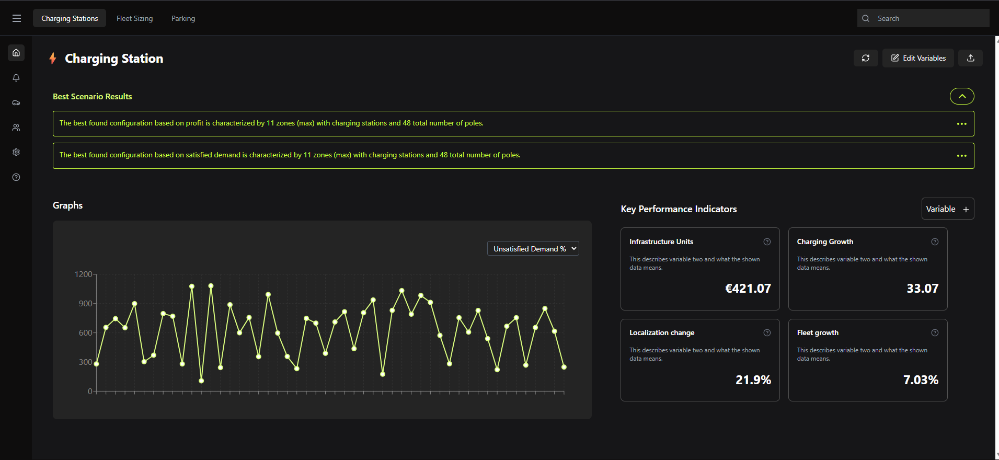
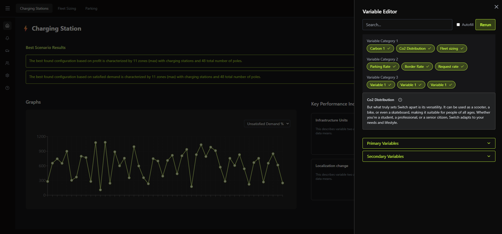

# Charging Station Dashboard


A dynamic and interactive dashboard for visualizing and analyzing charging station data. This application, built with React and Redux, provides users with a comprehensive interface to monitor Key Performance Indicators (KPIs), explore data trends through interactive charts, and customize data views using a powerful variable editor. It features secure user authentication via Firebase, a detailed view for specific data points, and data export capabilities.

## Key Features

-   **Firebase Authentication**: Secure login with email/password and Google Sign-In.
-   **Interactive Dashboard**: A central dashboard displaying key metrics and an interactive line chart powered by Recharts for data visualization.
-   **KPI Cards**: At-a-glance view of important metrics like Infrastructure Units, Charging Growth, and Fleet Growth.
-   **Variable Editor**: A slide-over panel to dynamically edit variables, filter the displayed data, and re-run scenarios.
-   **Detailed Data View**: Click on data points in the chart to navigate to a dedicated screen with comprehensive information about that point.
-   **State Management**: Centralized application state managed efficiently with Redux Toolkit and `redux-persist` for a seamless user experience.
-   **Modern UI**: A sleek, dark-themed interface built with Tailwind CSS, Framer Motion for animations, and `lucide-react` for icons.
-   **Data Export**: Utility functions to export KPI and chart data to CSV or PDF formats.

## Tech Stack

-   **Frontend**: React, TypeScript, Redux Toolkit
-   **Styling**: Tailwind CSS
-   **Authentication**: Firebase
-   **Charting**: Recharts
-   **Routing**: React Router
-   **Animation**: Framer Motion

## Getting Started

To get a local copy up and running, follow these simple steps.

### Prerequisites

-   Node.js (v16 or later)
-   npm

### Installation

1.  **Clone the repository**
    ```sh
    git clone https://github.com/gautamkumarcode/charging-station.git
    cd charging-station
    ```

2.  **Install NPM packages**
    ```sh
    npm install
    ```

3.  **Set up Firebase**
    Create a `.env` file in the root of the project and add your Firebase project credentials. These are required for authentication to work.

    ```env
    REACT_APP_FIREBASE_API_KEY=your_api_key
    REACT_APP_FIREBASE_AUTH_DOMAIN=your_auth_domain
    REACT_APP_FIREBASE_PROJECT_ID=your_project_id
    REACT_APP_FIREBASE_STORAGE_BUCKET=your_storage_bucket
    REACT_APP_FIREBASE_MESSAGING_SENDERID=your_messaging_sender_id
    REACT_APP_FIREBASE_APPID=your_app_id
    REACT_APP_FIREBASE_MEASUREMENTID=your_measurement_id
    ```

### Running the App

In the project directory, you can run:

```sh
npm start
```

This runs the app in development mode. Open [http://localhost:3000](http://localhost:3000) to view it in your browser. The page will reload when you make changes.

## Available Scripts

-   `npm start` or `npm run dev`: Runs the app in development mode.
-   `npm test`: Launches the test runner in interactive watch mode.
-   `npm run build`: Builds the app for production to the `build` folder.
-   `npm run eject`: Removes the single build dependency from your project. Note: this is a one-way operation.

##UI Images

